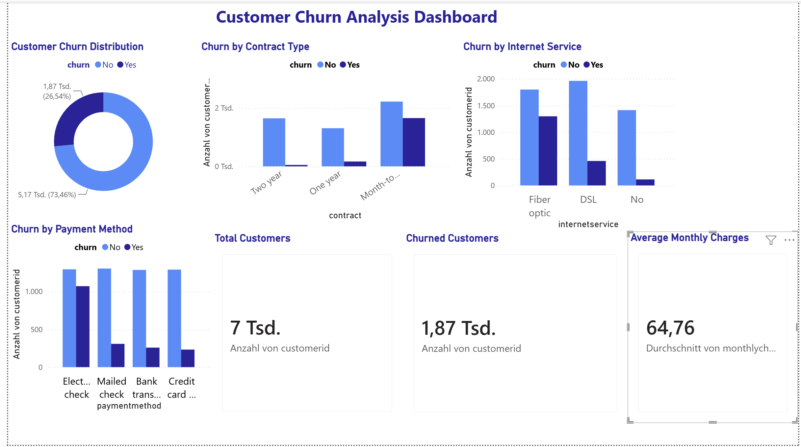

# Customer Churn Analysis using SQL & Power BI

## Project Overview

This project analyzes customer churn patterns in a telecommunications company using PostgreSQL, SQL, and Power BI.

The objective was to identify the main factors influencing customer attrition, evaluate customer retention drivers, and provide actionable business recommendations based on data analysis.

The dataset contains 7,043 customer records, including demographic information, service subscriptions, contract details, billing information, and churn status.

---

## Business Objective

The main goals of this project were:

- Measure the overall customer churn rate.
- Identify which contract types have the highest churn.
- Analyze the relationship between customer tenure and churn.
- Evaluate the impact of monthly charges on customer retention.
- Determine which internet services and payment methods are associated with higher churn rates.


## Dataset

Source: Kaggle Telco Customer Churn Dataset

Dataset Characteristics:

- 7,043 customer records
- Customer demographics
- Service subscriptions
- Billing information
- Contract details
- Customer churn status

Main Variables:

- Customer ID
- Gender
- Tenure
- Internet Service
- Contract Type
- Payment Method
- Monthly Charges
- Total Charges
- Churn

---

## Tools Used

- PostgreSQL
- SQL
- Power BI
- GitHub

---

## SQL Techniques

The project includes:

- Aggregations (COUNT, AVG)
- GROUP BY
- ORDER BY
- Customer Segmentation
- KPI Analysis
- Churn Analysis

---

## Dashboard



---

## Key Findings

### 1. Contract Type and Churn

Customers with month-to-month contracts showed the highest churn rate, while customers with two-year contracts demonstrated the strongest retention.

### 2. Customer Tenure

Customers who churned had an average tenure of approximately 18 months, compared to nearly 38 months for retained customers.

### 3. Monthly Charges

Customers who left the company paid higher monthly charges on average than retained customers.

### 4. Internet Service

Fiber Optic customers exhibited the highest churn rate among all internet service categories.

### 5. Payment Method

Customers using Electronic Check were significantly more likely to churn than customers using automatic payment methods.

---

## Business Recommendations

Based on the analysis, the following recommendations were identified:

- Encourage customers to switch to long-term contracts.
- Improve retention programs for new customers.
- Review pricing strategies for high-cost service plans.
- Investigate dissatisfaction among Fiber Optic customers.
- Promote automatic payment methods to improve customer retention.

---

## Project Structure

```text
customer-churn-analysis/

├── data/
│   └── customer_churn.csv

├── sql/
│   └── churn_analysis.sql

├── powerbi/
│   └── customer_churn_dashboard.pbix

├── screenshots/
│   └── customer_churn_dashboard.png

└── README.md
```

---

## Author

Yulia Schaibel

Data Analytics Portfolio Project | 2026
